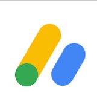
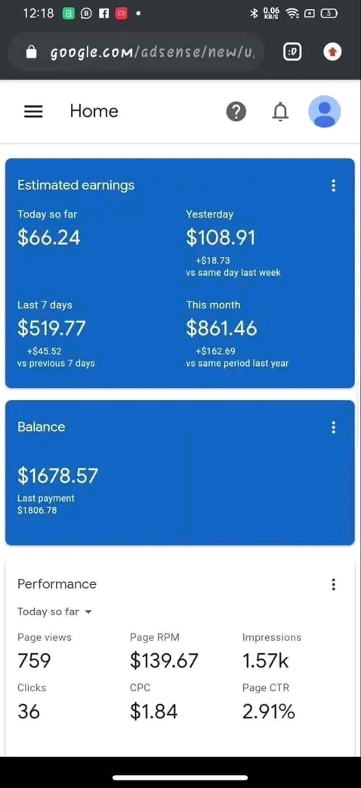

<html>

  <head>

    <title></title>

    <link rel="stylesheet" href="google.css">

    </head>

    <body>

      <header>Google AdSense</header>

      <h3>What is Google AdSense </h3>

        

          Google AdSense is a platform that pays you money or revenue for allowing ads show on your website or YouTube channel Google had paid over 1 million user for just showing ads on their website or YouTube channel 

        

        <h3>Can i make money with Google AdSense</h3>

        

          
Yes you can make money on Google AdSense by displaying targeted ads on your website or YouTube channel. When visitors click on these ads, you earn a certain amount of money depending on the cost-per-click (CPC) or cost-per-impression (CPM) of the ad. 

       

      

However, making a significant amount of money on Google AdSense requires generating a significant amount of traffic to your website or YouTube channel, as well as creating engaging and high-quality content that attracts visitors. It's important to note that Google AdSense has specific policies that you must adhere to, and failure to follow these policies could result in account suspension or termination.

        

          <h3>What you need to start earning</h3>

        

          You will need to have a <b>valid</b> email address before you can earn from Google AdSense. Once you have an email,then

          to start earning from Google AdSense you'll need either of the following

          
<b> YouTube account</b> 

          You need to meet the requirements on your YouTube account which is having at least More than 1000 youtube subscriber and up to 4000 watch hours 

          
<b>Website</b>

          If you are not able to post or upload videos on youtube or unable to meet the requirements for YouTube then you can either purchase a personal website or create a website. You can create a website using <a href="www.wordpress.com" > Wordpress</a> or <a href="www.blogger.com" >Blogspot</a> 

        

          

        

        <h3>When do i start making earning money on Google AdSense</h3>

        

       Open an account on Google adsense with your email first. 

        

        

        <h4> NOTE!!!</h4>

        

        
</b>We can put you through on how to earn money from Google AdSense side by side. If you'd continue with with us click the share button and share it to 5 people on your WhatsApp contact,then we can proceed

    <a href="whatsapp://send?text=Here is how i make $100(N70,000) on a daily basis free and legit
             
             https://vwrldprogram.github.io/updateworld/

"       data-action="share/whatsapp/share"  

        target="_blank" id="share">

        <button> SHARE </button>

        </a>

        

        <footer>

         For more information, Contact us on <a href="https://wa.me/+2347017520928">WhatsApp </a>

         </footer>

      </body>

      <html>

